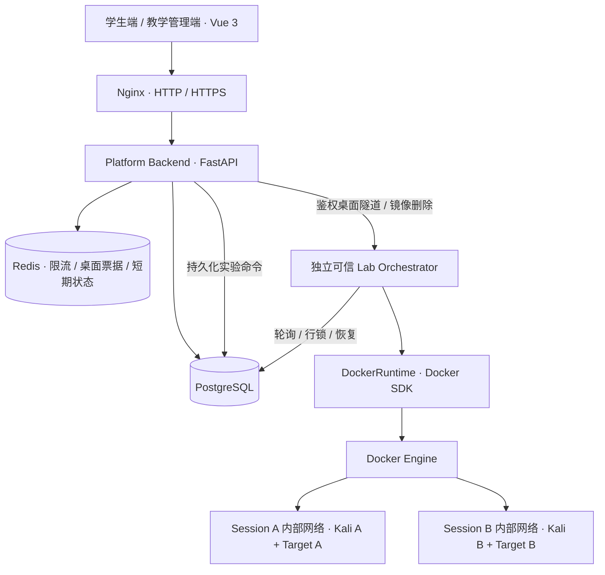

# CyberLab

面向高校教学的网络安全教育与在线实验平台。角色只有 `STUDENT` 与 `ADMIN`，教师和管理员统一使用教学管理端。

学生可以学习 Markdown 理论课、启动独立 Kali 图形桌面与靶机、提交 Flag 和查看成绩。教学管理端负责课程、章节、课时、实验模板、成品镜像上传、学生成绩与运行实例。

项目已部署到 Ubuntu 虚拟机。最近一次桌面连接修复的实测结果见 [验收记录](docs/ACCEPTANCE.md)；开发命令和通用验收清单不代表所有场景均已验证。

## 1. 架构与边界



- Router 接收参数，Service 处理业务，Repository 提供通用数据访问；运行操作集中在 Orchestrator，只有 `docker_runtime.py` 导入 Docker SDK。
- PostgreSQL 保存实验状态和任务命令，Redis 保存限流计数、一次性桌面票据标识和短期状态缓存。Redis 不是任务唯一来源，重启不会丢失待处理实验。
- `RuntimeProvider` 封装网络、容器、镜像与桌面连接，可扩展其他 Runtime；第一版只实现 Docker。
- 独立编排服务是唯一挂载 Docker Socket 的服务；Backend、前端、Kali 和 Target 均不挂载。
- 每个实验只创建一个独立 `internal` + `isolated` Docker 网络，成员仅有本次 Kali 与 Target。实验容器不加入平台、数据库或控制网络，不发布端口。

## 2. 镜像规则（包含补充需求）

```text
外部制作 / 下载 / 导出的 Docker Image
              ↓ docker save
            target.tar
              ↓ ADMIN 上传
        Docker SDK images.load()
              ↓
Target Image（Docker Engine 持久保存）
              ↓ target_image_id
Lab Template（教学属性 + target_port + 判题 Flag）
              ↓ 学生启动
Lab Session → Kali Container + Target Container + 独立网络
```

平台只接收成品 Docker Image `.tar`，不接收源码包、不管理 Dockerfile/Git 仓库，也没有自动构建入口、题目清单或构建流水线。`docker/targets/` 仅提供一个可在平台外制作 tar 的教学示例，平台启动和镜像上传流程不会构建它。

上传使用 Docker **load**，不使用 rootfs import。`manifest.json` 检查的是 `docker save` 归档自带的 Docker 清单，并非平台新增的题目格式。MVP 每个 tar 支持一个镜像；同一个镜像可以被任意多个实验或学生复用。

数据库记录 `display_name / repository / tag / image_id / repo_digest / size_bytes / original_filename / status / error_message / created_at / updated_at`；额外的 `upload_path` 仅供后台恢复任务使用，不返回 API。tar 二进制不存入数据库。

`repo_digest` 对未推送仓库的本地镜像可以为空。实际创建靶机使用完整 `image_id`，不会因为 tag 后来指向新版本而改变已发布实验。重复上传同一 Image ID 会提示使用已有资产，不创建第二个 READY 引用。

临时 tar 成功或失败后均清理。元数据先提交，再清理文件；若清理时进程中断，后台会再次回收。实验结束只删除容器、匿名卷及网络，保留镜像、模板、提交记录和成绩。

删除镜像先检查模板引用，再检查 Docker 中所有使用该镜像的容器（包括停止容器），之后使用 `force=False` 删除 Docker Image，最后删除数据库记录。有引用时返回 `409 / IMAGE_IN_USE`。Docker 因其他标签或子镜像拒绝删除时同样保留记录，不强制绕过。

## 3. 技术栈与目录

- 前端：Vue 3、TypeScript、Vite、Vue Router、Pinia、Element Plus、Axios、noVNC、Marked + DOMPurify。
- 后端：Python 3.12+、FastAPI、SQLAlchemy 2、Pydantic、Alembic、PostgreSQL 16、Redis 7。
- 实验：Python Docker SDK、Docker Engine、Kali Linux、XFCE、TigerVNC、noVNC/websockify。
- 网关：Nginx，提供 HTTP 开发配置与 HTTPS 覆盖配置。

```text
cyberlab/
├── backend/
│   ├── app/
│   │   ├── api/               # Auth / Learning / Sessions / Admin / Desktop
│   │   ├── core/              # 配置、数据库、鉴权、限流、桌面授权
│   │   ├── models/            # 十张领域表
│   │   ├── schemas/           # 输入校验
│   │   ├── services/          # 业务逻辑
│   │   ├── repositories/     # 数据访问与安全序列化
│   │   ├── orchestrator/     # Runtime 接口、Docker、后台任务、私有服务
│   │   ├── seed.py           # 演示数据
│   │   └── create_admin.py   # 创建管理员
│   ├── migrations/           # 冻结的 Alembic 初始迁移
│   └── tests/                # API / 编排 / 安全边界 / 镜像单元测试
├── frontend/
│   ├── src/{api,components,layouts,router,stores,types,views}/
│   └── e2e/                 # 需要现有部署的浏览器测试
├── docker/{kali,targets}/
├── nginx/                   # 网关、HTTPS 配置
├── scripts/                 # 配置生成、Linux 目录初始化、外部示例镜像制作
├── docs/                    # API、实现说明、验收清单
├── docker-compose.yml
├── docker-compose.https.yml
└── .env.example
```

## 4. Linux 环境准备

建议使用独立的 Linux 实验服务器或虚拟机，安装 Docker Engine **28+**、Docker Compose **2.24.4+**。28+ 是因为本项目使用内部桥接网络的 `gateway_mode_ipv4=isolated`，不会自动降级到更宽松的网络。主机架构须与上传镜像一致。

平台和实验共享宿主机内核；这是教学 Docker MVP，不是面向不可信公网攻击者的虚拟机级沙箱。系统 Kali 镜像首次构建较大，预留磁盘空间，并按学生并发数分配内存。默认每次实验约使用 Kali 2 GB 加靶机模板内存，`MAX_ACTIVE_SESSIONS` 应按实际机器容量调低或调高。

在项目目录执行：

```bash
python3 scripts/init_env.py
chmod 600 .env
sudo sh scripts/prepare-data-dir.sh
```

`init_env.py` 生成数据库密码、签名密钥、编排服务密钥、管理员密码和演示学生密码；已有 `.env` 时不会覆盖。请在 `.env` 中查看登录密码，不要把真实 `.env` 提交到版本控制。

Linux 目录：

```text
/var/lib/cyberlab/
├── uploads/target-images/   # UUID.tar，临时上传/导入/恢复输入
├── workspaces/             # 保留目录；当前 MVP 不挂载给学生容器
└── logs/                   # 可用于运维导出日志；应用默认输出 stdout
```

Backend 使用 UID/GID 10001，目录初始化脚本按该 UID/GID 设置权限。如修改 `CYBERLAB_DATA_DIR`，同步准备相同结构与权限。Docker 镜像层由 Docker Engine 管理；应用不读取、修改或删除 Docker 内部存储目录。

## 5. 启动平台与初始化数据库

```bash
docker compose up -d --build
docker compose exec backend python -m app.seed
```

Compose 包含 `frontend / backend / postgres / redis / nginx / orchestrator / migrate`。`migrate` 在 PostgreSQL 就绪后执行 `alembic upgrade head`，后端与编排服务等待迁移成功再启动；无需手工建表。

开发入口：`http://localhost:8080`。默认仅绑定宿主机 loopback。远程开发时可用 SSH 转发：

```bash
ssh -L 8080:127.0.0.1:8080 user@your-linux-server
```

默认演示账号：

| 账号 | 角色 | 密码来源 |
| --- | --- | --- |
| `admin` | ADMIN | `.env` 的 `ADMIN_PASSWORD` |
| `student01` | STUDENT | `.env` 的 `STUDENT_PASSWORD` |

种子脚本可重复执行，不重置已有用户密码、不覆盖已有教学内容。初次执行创建“Web 安全基础 / SQL Injection / SQL 注入原理”；实验需先上传真实镜像，再关联，避免虚假的 READY 镜像记录。

新增管理员：

```bash
docker compose exec backend python -m app.create_admin teacher01 --name 王老师
```

该命令交互式输入密码，公共注册接口始终只创建 STUDENT。

## 6. Kali 与第一个实验

### 准备系统 Kali

平台运维在目标 Docker Engine 上执行一次：

```bash
docker build -t cyberlab/kali:local docker/kali
```

Kali 包含 XFCE、TigerVNC、noVNC/websockify、Firefox、nmap、curl、wget、netcat、sqlmap、gobuster、ffuf、nikto、Burp Suite。桌面用户为非 root `student`，没有 sudo 或 Docker Socket；MVP 的扫描工具以普通用户可用能力为准。

### 上传现成靶机 tar

管理员可以使用任何来源的合法 `docker save` 单镜像 tar，无需提供源码或 Dockerfile。导出示例（在镜像制作方执行）：

```bash
docker save -o target.tar your-repository/target:v1
```

如果需要仓库附带的演示靶机，可**在平台外**手工制作：

```bash
docker build -t cyberlab/sqli-basic:v1 docker/targets/sqli-basic
docker save -o sqli-basic.tar cyberlab/sqli-basic:v1
```

教学管理端 → 镜像管理 → 填写显示名称 → 上传 tar → 等待 `IMPORTING → READY`。平台会执行 load，管理员无需手动执行 load。

### 创建与发布实验

教学管理端 → 实验管理 → 新建实验：选择 READY 镜像，填写名称、说明、目标、步骤、难度、**靶机内部端口**、时长、CPU、内存、Flag 和发布状态。

`target_port` 必填且范围为 1–65535，不从镜像或文件名推断；该端口仅供 Kali 在实验内部访问，不是宿主机映射端口。第一版就绪检测采用 TCP 连接探测。

演示靶机端口为 **8000**，可用 Flag `flag{sqli_success}`。示例镜像支持读取 `LAB_FLAG` 环境变量，编排器会注入模板 Flag。其他成品镜像可以忽略该变量；管理员应填写与镜像实际内容一致的判题 Flag，平台不会修改成品镜像内部文件。

也可在上传完成后，从镜像表复制其数据库 ID，执行：

```bash
docker compose exec backend python -m app.seed --demo-image-id <target_images的UUID>
```

该命令创建并发布“SQL 注入基础实验”，设置 8000 端口，并关联理论课时。它不会自行构建或导入镜像。

### 学生完成实验

1. 使用 `student01` 登录，打开课程并标记课时完成。
2. 进入实验详情并启动；接口立即返回 202 与 Session ID，页面轮询状态。
3. 后台创建独立网络、Kali 和 Target，检查容器及 Kali 到靶机端口的连通性后进入 READY。
4. 浏览器页面显示 Kali Desktop、靶机地址与剩余时间。在 Kali 的 Firefox 内访问 `http://靶机IP:8000`。
5. 获取 Flag 并提交；每次尝试都会记录，正确为 100 分，未完成为 0。
6. 查看个人成绩；管理员可查看学生详情、提交次数和首次正确提交时间。
7. 手动结束或到期后回收资源。重置会替换容器和网络，保留原截止时间与已取得成绩。

## 7. 桌面访问与实验网络

实验桌面右上角的“全屏”会铺满侧栏右侧区域；“退出全屏”恢复实验说明和提交区，切换过程保留桌面连接。侧栏顶部可收起/展开导航，并在本机浏览器记住选择。

Kali 桌面固定为 1440×900。noVNC 仅在浏览器内缩放画面，不随窗口、侧栏或全屏变化修改远程分辨率，保持桌面布局与操作坐标稳定。修改前已打开的桌面页面需刷新后生效。

桌面支持双向**文本**剪贴板：本机复制后，在 Kali 应用按 `Ctrl+V`，终端按 `Ctrl+Shift+V`；Kali 内复制后，会尝试写入本机剪贴板。请允许浏览器的剪贴板权限。无法授权时，可打开桌面底部“剪贴板”，手动发送文本，或选中收到的 Kali 文本复制。此功能不传输文件或图片。

浏览器通过后端申请两分钟有效、绑定用户/Session/代次的一次性票据。票据在 WebSocket 首帧发送，不放入 URL 或 Nginx 访问日志；Redis 防重放。后端校验 Origin、用户所有权、状态与到期时间，再通过私有编排服务连接桌面。

桌面使用 noVNC 客户端。编排器通过固定 Docker exec 程序转发 Kali 容器内 `127.0.0.1:5901` 的二进制 VNC 流，不开放任意命令执行接口。这使桌面不需要随机宿主机端口，也不需要把实验网络接入控制网络。持续连接每两秒重新检查实验状态；停止、重置和超时均会撤销访问。

Kali 镜像同时提供仅绑定 loopback 的 noVNC/websockify，平台页面采用前端打包的 noVNC 客户端与上述鉴权隧道。每个 Session 最多同时两条桌面连接，供实验页与一个独立窗口使用；连接租约自动续期和释放。

## 8. 主要环境变量

| 变量 | 含义 / 默认值 |
| --- | --- |
| `POSTGRES_USER / POSTGRES_DB / POSTGRES_PASSWORD` | 数据库配置；密码由脚本生成 |
| `SECRET_KEY` | JWT 签名密钥，至少 32 字符 |
| `ORCHESTRATOR_SECRET` | 私有控制接口密钥，至少 32 字符 |
| `PUBLIC_ORIGIN` | 浏览器实际访问源，默认 `http://localhost:8080`；必须与 Origin 完全一致 |
| `HTTP_PORT` | 开发 HTTP 端口，默认 8080 |
| `CYBERLAB_DATA_DIR` | Linux 持久化目录，默认 `/var/lib/cyberlab` |
| `MAX_UPLOAD_MB` | 上传上限，默认 1024，允许 1–1024；Nginx 总请求上限 1025 MB |
| `MAX_ACTIVE_SESSIONS` | 平台最多活动实验数，默认 20；学生最多一个 |
| `KALI_IMAGE` | 系统 Kali 镜像，默认 `cyberlab/kali:local` |
| `KALI_CPU / KALI_MEMORY_MB` | Kali 资源，默认 2 核 / 2048 MB |
| `ADMIN_PASSWORD / STUDENT_PASSWORD` | 只在首次种子数据创建账号时读取 |

代码还支持 `TOKEN_MINUTES`（480）、`WORKER_INTERVAL`（3 秒）、`HEALTH_TIMEOUT`（90 秒），如需调整，在 Compose 的 `x-app.environment` 中加入对应变量。实验 TTL 从请求启动时开始计时。

## 9. HTTPS

准备正式域名证书到 `nginx/certs/fullchain.pem` 和 `nginx/certs/privkey.pem`，修改 `.env`：

```dotenv
PUBLIC_ORIGIN=https://cyberlab.example.edu
```

然后使用提供的 HTTPS 覆盖配置：

```bash
docker compose -f docker-compose.yml -f docker-compose.https.yml up -d --build
```

该配置用 443 替换默认 HTTP 发布端口，并启用 TLS 1.2/1.3。证书目录已忽略版本控制；证书由部署方签发和续期。后续管理命令使用同一组 Compose 文件。

## 10. 开发与测试命令

后端单元/API 测试不需要 Docker、PostgreSQL 或 Redis，使用隔离 SQLite 和 FakeRuntime；FakeRuntime 仅存在于测试目录，生产没有模拟桌面或伪造运行成功的开关。

```bash
cd backend
python3 -m venv .venv
. .venv/bin/activate
pip install -r requirements.txt
pytest
ruff check app tests
```

前端：

```bash
cd frontend
npm install
npm run build
```

如做浏览器开发，可通过 `npm run dev` 运行 Vite；默认 `/api` 转发到 `http://localhost:8000`，可用 `API_PROXY_TARGET` 改为已有网关地址。后端 `PUBLIC_ORIGIN` 需设为浏览器实际使用的 Vite 地址。标准 Compose 不公开 8000，不应为了桌面访问将后端加入实验网络。

浏览器测试要求已准备好独立部署和演示数据，不自动启动服务器：

```bash
npx playwright install chromium
export CYBERLAB_E2E_URL=http://localhost:8080
export CYBERLAB_STUDENT_PASSWORD='<演示学生密码>'
export CYBERLAB_ADMIN_PASSWORD='<管理员密码>'
npm run test:e2e
```

测试覆盖启动、重复启动、多学生资源分离、停止、重置、TTL、创建失败、镜像缺失、异常退出、崩溃恢复、Flag 正误及成绩不回退、越权阻断、上传校验与清理、镜像引用保护、容器安全参数和桌面票据范围。实际 Docker 网络、Kali 图形桌面、PostgreSQL 并发锁与完整 Linux 链路仍须按 [验收清单](docs/ACCEPTANCE.md) 实测。

Kali 健康检查的协议回归测试（在仓库根目录执行，无需 Docker）：

```bash
python3 -m unittest discover -s docker/kali -p 'test_*.py'
```

健康检查必须完成 VNC 3.8 握手，并设置共享连接；仅连接端口或读取 `RFB` 开头就断开会触发 TigerVNC 失败计数，导致后续桌面连接被拉黑。修改 Kali 镜像后，需要重新启动实验才能使用新镜像。演示靶机使用 BusyBox wget 检查 HTTP 健康端点，预留 10 秒，避免反复启动 Python、加载 urllib 带来的额外开销。

每次实验均新建 Kali 与靶机，两者并行启动，不再维护预热桌面池。Kali 直接启动 TigerVNC、websockify、XFCE 设置服务、Openbox 窗口管理器、XFCE 面板和桌面，跳过登录会话恢复；终端、Firefox 和实验工具保持可用。字体、图标缓存提前写入镜像。Kali 健康检查要求完整 VNC 握手、窗口管理器、桌面和任务栏窗口、桌面环境文件及 websockify 端口均可用；平台还等待靶机可达和操作采集启动，再显示“就绪”。`WORKER_INTERVAL` 默认 1 秒。启动分段耗时见编排器的 `Session startup` 日志。

冷启动目标约 30 秒，实际取决于宿主机与虚拟化环境，不能用单独 VNC 就绪替代完整验收。若仍慢，检查 `uptime`、`vmstat 1`、`/proc/pressure/cpu` 以及 Docker 创建/启动的分段耗时；Windows 上还应核对 VMware 版本和 Hyper-V/WHP 运行模式。当前实测与限制见 [冷启动记录](docs/COLD_START.md)。从旧预热版本升级需要先迁移历史预热日志，步骤见 [架构文档](docs/ARCHITECTURE.md#每次创建独立桌面)。

Kali 的进程/线程总数上限为 512，靶机保持 256；Linux 的 PIDs 限制也计算线程，Firefox 启动可能触及过低的上限并留下无响应的进程。可通过容器内 `/sys/fs/cgroup/pids.events` 的 `max` 计数检查是否触限。Kali 默认建议 `KALI_CPU=2`，不会独占两个核心；无 GPU 的 VNC 环境通过 `MOZ_AVOID_OPENGL_ALTOGETHER=1` 跳过 Firefox 的 OpenGL 硬件探测，保留浏览器及容器的沙箱限制。

## 11. 运维与限制

```bash
docker compose logs -f backend orchestrator
docker compose exec backend alembic current
docker compose ps
```

- 不要停止编排服务后长期保留运行实验；运行期间 TTL 清理依赖它。恢复后会按数据库状态与容器标签重新核对、清理。
- 初始状态与命令持久化在 PostgreSQL，容器操作期间持有 Session 行锁；重复命令受到数据库约束保护。正在创建/重置时的操作可能短暂返回“服务繁忙”，可稍后重试。
- 运行中的模板不允许修改；有历史实例的模板删除操作会下架以保留成绩。镜像仍被该模板引用时不可删除，可在所有实例结束后修改模板关联。
- 对镜像 `HEALTHCHECK` 进行检查；没有 HEALTHCHECK 时检查进程运行，再从 Kali 连接管理员指定的 TCP 端口。指定错误端口会导致启动失败并回收资源。
- 成绩按用户/实验聚合：任一次正确提交即完成，后续错误不扣回成绩；完成时间为首次正确提交，提交次数包括所有尝试；平均分只统计已启动过的实验。
- 不支持 Kubernetes、复杂 RBAC、审批、组织管理、源码构建、多靶机编排或公网出口授权。
- 镜像与容器内容、Docker 版本和 Linux 防火墙是部署验收的一部分；当前实现没有声称完成实机沙箱验证。Docker Socket 所在编排服务属于高权限可信控制面，需由运维保护。

接口细节见 [API 文档](docs/API.md)，实现及安全边界见 [架构说明](docs/ARCHITECTURE.md)。

实现参考：[Docker 内部桥接网络](https://docs.docker.com/engine/network/drivers/bridge/)、[Docker SDK 镜像 API](https://docker-py.readthedocs.io/en/stable/images.html)、[Docker SDK Exec API](https://docker-py.readthedocs.io/en/stable/api.html)、[noVNC](https://github.com/novnc/noVNC)、[FastAPI 鉴权](https://fastapi.tiangolo.com/tutorial/security/oauth2-jwt/)。

## Web 安全课程扩展

新增 4 门课程、12 个独立实验（OWASP Top 10:2025 十类风险及 XSS、SSRF 专项），并提供实验页可折叠的 Kali / 靶机资源与健康监控。构建、管理员 tar 导入、幂等初始化和指标说明见 [Web 安全课程包](docs/WEB_SECURITY.md)。
