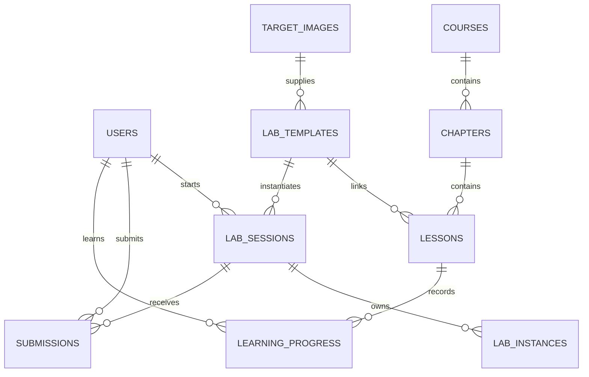
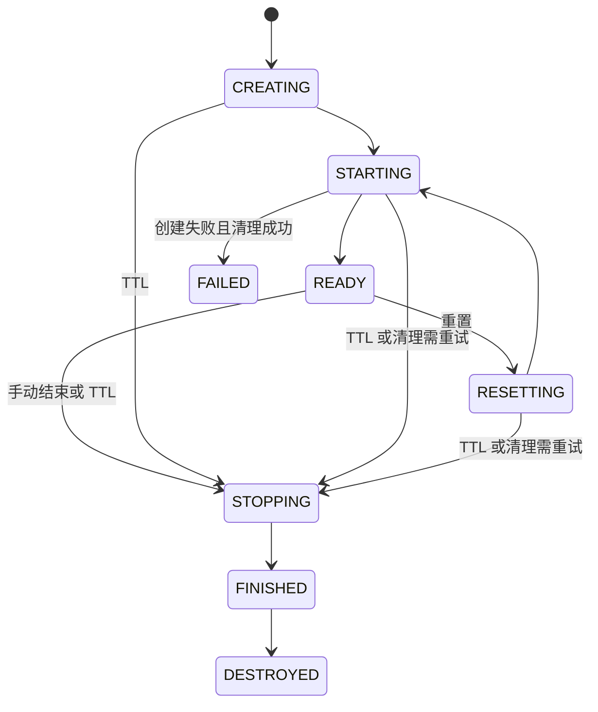

# 实现说明

## 数据模型

`TargetImage` 是 Docker Engine 中的持久资产引用；`LabTemplate` 保存教学配置和显式 `target_port`；`LabSession` 是一次学生操作；`LabInstance` 记录 Kali/Target 运行实例。镜像没有教学属性，每个学生只创建容器，不复制镜像。

`submissions` 保存每次答案、正误、得分和时间；成绩、首次完成时间和提交次数从原始记录聚合，避免另建成绩表造成双写不一致。学生 API 从不序列化 `flag`、`submitted_flag`、`password_hash`、`upload_path`。

## 状态与并发

- 启动请求只验证条件并写 CREATING；后台执行 Docker 操作，HTTP 不等待桌面启动。
- 一个学生同时最多一个活动 Session，数据库部分唯一索引防止并发绕过。
- 同一用户重复启动同一实验返回已有 Session，启动另一个实验返回 409。
- PostgreSQL 事务级 advisory lock 序列化全局容量检查；用户/模板行锁保护相关业务变化。
- 编排器每 3 秒检查待处理实例，使用 `FOR UPDATE SKIP LOCKED` 领取；每个实例一个有界线程，慢启动不阻塞其他实验 TTL。
- 一个实例的 Docker 生命周期操作由同一 Session 行锁串行化；创建期间轮询可暂时仍看到已提交的 CREATING/RESETTING，直到 READY 或失败结果提交。
- 上传导入使用独立线程循环，不占用 Session TTL 轮询。镜像导入 advisory lock 避免多个编排进程重复写入同一 Image ID。
- 重置保持原 `expires_at`，删除旧代资源后重新创建；`generation` 撤销此前的桌面连接。
- FINISHED 是清理事务中的结束阶段，外部最终状态通常直接观察为 DESTROYED。判题正确只记录完成成绩，不提前关闭桌面。
- 启动失败时先清理已经创建的部分资源；清理失败则保留 STOPPING，后台持续重试，不能将尚未回收的资源伪装成已销毁。

## 恢复与清理

Docker 资源带系统生成 UUID 及 `cyberlab.managed / cyberlab.session / cyberlab.type` 标签。即使进程在创建容器后、数据库提交前中断，后续恢复也可通过标签定位资源。

编排器每分钟核对标签资源与数据库，清理孤立、终态实例的资源，同时清理未关联记录且超过一天的中断上传文件。导入完成/失败先提交元数据再删除临时 tar，删除文件失败时保留路径，下一次核对重试。

Docker Image 不参与 Session TTL 清理。删除镜像由独立 ADMIN 操作触发，检查所有模板和容器引用，禁止强制删除。模板保存和镜像删除采用相同的镜像行锁，防止“刚检查完无人引用，另一请求立刻关联”的竞态。

## 每次创建独立桌面

实验启动、重试和重置均新建 Kali 与 Target，不维护停放桌面池。两种容器在独立实验网络上并行创建、启动；数据库操作仍在编排主线程完成。任何一路失败都会先等待另一路结束，再按 Session 标签回收全部资源，避免迟到的创建操作泄漏容器。

Kali 直接启动 TigerVNC、websockify、XFCE 设置服务、Openbox、XFCE 面板和桌面，不加载登录会话恢复流程。字体和图标缓存在镜像构建时生成。健康检查要求 VNC 完整握手、窗口管理器、桌面、面板和桌面环境文件均可用；编排器还检查靶机可达及操作采集就绪，才提交 READY。

操作日志统一位于 `activity/<session>/<generation>/`。从旧预热版本升级前，应停止活动实验，将旧 `activity/warm/<slot>/<session>/<generation>/` 日志迁入统一目录，检查冲突并保留原记录，再移除停放容器和空的停车网络。新版本不再识别旧预热日志路径。

编排日志的 `Session startup` 记录 cleanup、network-created、kali-started、target-started、containers-healthy 和 activity-ready 各阶段累计秒数。启动性能应以真实 API 请求到 READY 的完整耗时验收；镜像预先构建并存在本机，但不能复用已经启动的 Kali。

## 网络与桌面

| 网络 | 服务/容器 | 宿主机发布端口 |
| --- | --- | --- |
| platform-net | Nginx、Frontend、Backend | 仅 Nginx 开发 HTTP 或正式 HTTPS |
| database-net（internal） | PostgreSQL、Redis、Backend、Orchestrator、迁移 | 无 |
| lab-control-net（internal） | Backend、Orchestrator | 无 |
| lab-net-UUID（internal + isolated） | 本次 Kali、Target | 无 |

实验内部网络关闭外部路由且不配置桥接口地址；默认 DNS 上游设为容器 loopback，避免通过宿主机 DNS 转发获得公网查询能力。网络隔离依赖 Docker Engine 28+ 的桥接驱动与主机网络规则，须在目标 Linux 上实测。

桌面通路：浏览器 noVNC → 后端 WebSocket → 私有编排 WebSocket → Docker exec 固定转发程序 → Kali loopback VNC。每个层级都没有用户可指定的命令、目标主机、路径或端口；固定转发脚本没有 shell 拼接。

浏览器先发送短期票据，后端消费 Redis 中的一次性标识；票据绑定 subject、Session、generation、有效期和用途。私有编排器再次验证；运行中每两秒检查状态和截止时间，不能依靠已经建立的 WebSocket 越过 TTL。

## 容器约束

- 不使用 privileged、host network、宿主机目录挂载、Docker Socket、宿主机设备或随机公开端口。
- CPU、内存、swap、PIDs、日志容量由平台统一限制。
- `cap_drop=ALL`，Kali 仅配置 NET_RAW 边界能力；Target 不额外增加 capabilities。
- `no-new-privileges` 阻止通过 setuid 获得新增权限，Kali 图形桌面本身使用普通用户。
- Target 使用管理员上传镜像原有 CMD/ENTRYPOINT；平台不会执行题目构建或重写镜像文件。
- 默认拒绝与系统 Kali 完全同名的上传 tag，避免覆盖攻击机镜像；其他靶机版本按 Image ID 固定。

这些限制是 Docker 教学 MVP 的防护措施，并不把共享内核容器变成虚拟机。未来更强隔离可通过 RuntimeProvider 增加 Kata/Kubernetes 实现；本版不提供这些运行时。

## 第一版取舍

只提供两角色，不添加组织架构、审批或通用 RBAC。一个实验一个靶机、一个学生最多一个活动实验；不提供公网出口、GPU、Docker-in-Docker、root 提权型课程或多靶机拓扑配置。

数据库是状态真相来源，Redis 状态缓存可以重建。日志写 stdout，Docker 限制学生容器日志大小。系统未实现持久化学生桌面文件；重置/销毁时会丢失容器内改动，页面操作前会明确提示。

本次交付未运行自动化或实机验证。单元测试只证明其被执行后的逻辑预期，不能代替 Linux 防火墙、实际 Kali 图形启动或真实 PostgreSQL 并发验证。
